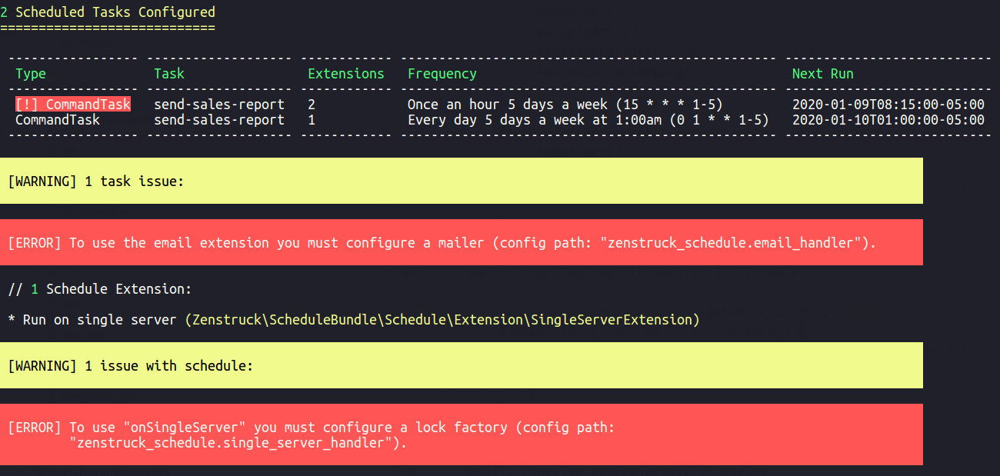
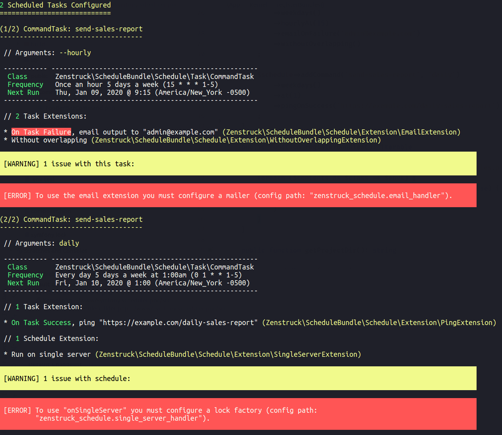
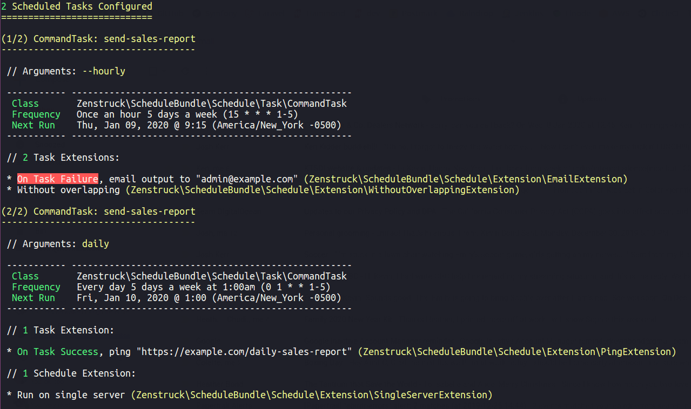
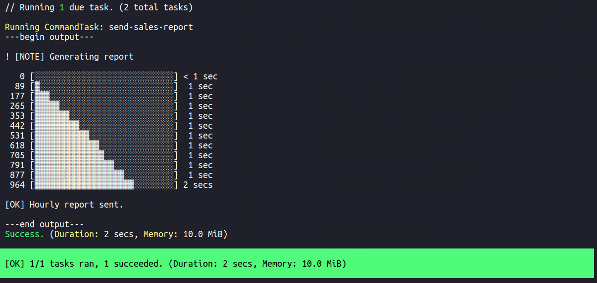

# CLI Commands

## schedule:list

```
Description:
  List configured scheduled tasks

Usage:
  schedule:list [options]

Options:
  --detail    Show detailed task list

Help:
  Exit code 0: no issues.
  Exit code 1: some issues.
```

This command lists your currently defined schedule. It displays useful information
and potential issues. The `--detail` option gives even more detail.

It is advisable to run this command as a CI build step to ensure your schedule does
not make it to production with issues (has exit code `1` if there are issues).

Consider the following schedule definition:

```yaml
# config/packages/zenstruck_schedule.yaml

zenstruck_schedule:
    schedule_extensions:
        on_single_server: ~
    
    tasks:
        -   command: send-sales-report --hourly
            frequency: '15 * * * 1-5' # hourly on weekdays
            without_overlapping: ~
            email_on_failure: admin@example.com

        -   command: send-sales-report --daily
            frequency: '0 1 * * 1-5' # 1am on weekdays
            ping_on_success: https://example.com/daily-sales-report
```

Assuming the bundle has no other configuration, running `schedule:list` shows the
following output (exit code `1`):

```console
$ bin/console schedule:list
```



Running with the `--detail` flag shows the following (exit code `1`):

```console
$ bin/console schedule:list --detail
```



There are two issues that need to be resolved in the bundle config:

```yaml
# config/packages/zenstruck_schedule.yaml

zenstruck_schedule:
    single_server_handler: lock.default.factory # required to use "onSingleServer"
    email_handler: # required to use "emailOnFailure"
        service: mailer
        default_from: webmaster@example.com
```

Running now shows the following (exit code `0`):

```console
$ bin/console schedule:list
```


Running with the `--detail` flag shows the following (exit code `0`):

```console
$ bin/console schedule:list --detail
```



## schedule:run

```
Description:
  Runs scheduled tasks that are due

Usage:
  schedule:run [<id>...]

Arguments:
  id    (optional) Task ID's to "force" run

Help:
  If no arguments are passed, all the tasks currently due are run. Pass one or
  more Task ID's to "force" run these even if they are not due (only these are
  run).

  Exit code 0: no tasks ran, schedule skipped, or all tasks run were successful.
  Exit code 1: one or more tasks failed.

  Add this command as a Cron job to your production server(s) running every minute:

  * * * * * cd /path-to-your-project && bin/console schedule:run >> /dev/null 2>&1
```

This is the command that runs currently due tasks. It should be added as a Cron
job to your production server(s) running every minute:

```
* * * * * cd /path-to-your-project && bin/console schedule:run >> /dev/null 2>&1
```

The above Cron job sends the command output to `/dev/null` but the command does
produce output if you wish to store that somewhere. Using the example from
`schedule:list` above and assuming one of the tasks are due at time of run, the
command will output the following  (exit code `0`):

```console
$ bin/console schedule:run
```


Running the command with the verbose flag (`-v`) displays task output:

```console
$ bin/console schedule:run -v
```


