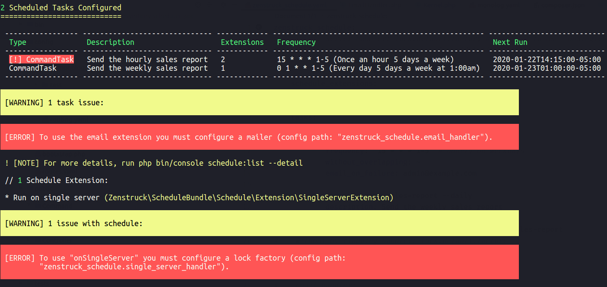
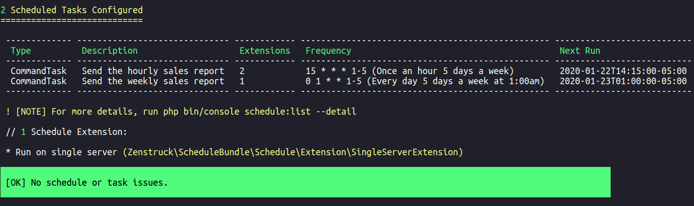
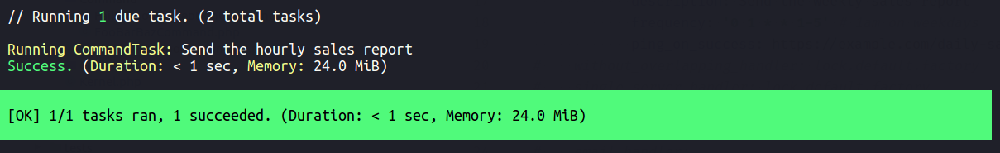

# CLI Commands

## schedule:list

```
Description:
  List configured scheduled tasks

Usage:
  schedule:list [options]

Options:
  --detail    Show detailed task list

Help:
  Exit code 0: no issues.
  Exit code 1: some issues.
```

This command lists your currently defined schedule. It displays useful information
and potential issues. The `--detail` option gives even more detail.

It is advisable to run this command as a CI build step to ensure your schedule does
not make it to production with issues (has exit code `1` if there are issues).

Consider the following schedule definition:

```yaml
# config/packages/zenstruck_schedule.yaml

zenstruck_schedule:
    schedule_extensions:
        on_single_server: ~
    
    tasks:
        -   command: send-sales-report --hourly
            description: Send the hourly sales report
            frequency: '15 * * * 1-5' # hourly on weekdays
            without_overlapping: ~
            email_on_failure: admin@example.com

        -   command: send-sales-report --daily
            description: Send the weekly sales report
            frequency: '0 1 * * 1-5' # 1am on weekdays
            ping_on_success: https://example.com/daily-sales-report
```

Assuming the bundle has no other configuration, running `schedule:list` shows the
following output (exit code `1`):

```console
$ bin/console schedule:list

2 Scheduled Tasks Configured
============================

 ----------------- ------------------------------ ------------ ------------------------------------------------- --------------------------- 
  Type              Description                    Extensions   Frequency                                         Next Run                   
 ----------------- ------------------------------ ------------ ------------------------------------------------- --------------------------- 
  [!] CommandTask   Send the hourly sales report   2            15 * * * 1-5 (Once an hour 5 days a week)         2020-01-22T14:15:00-05:00  
  CommandTask       Send the weekly sales report   1            0 1 * * 1-5 (Every day 5 days a week at 1:00am)   2020-01-23T01:00:00-05:00  
 ----------------- ------------------------------ ------------ ------------------------------------------------- --------------------------- 

 [WARNING] 1 task issue:

 [ERROR] To use the email extension you must configure a mailer (config path: "zenstruck_schedule.email_handler").      

 ! [NOTE] For more details, run php bin/console schedule:list --detail

 // 1 Schedule Extension:

 * Run on single server (Zenstruck\ScheduleBundle\Schedule\Extension\SingleServerExtension)

 [WARNING] 1 issue with schedule:

 [ERROR] To use "onSingleServer" you must configure a lock factory (config path:
         "zenstruck_schedule.single_server_handler").
```



Running with the `--detail` flag outputs the following (exit code `1`):

```console
$ bin/console schedule:list --detail

2 Scheduled Tasks Configured
============================

(1/2) CommandTask: Send the hourly sales report
-----------------------------------------------

 ------------------- ---------------------------------------------------- 
  ID                  9d2023944f540105dd47f7f314138fe92e40300c            
  Class               Zenstruck\ScheduleBundle\Schedule\Task\CommandTask  
  Command Arguments   --hourly                                            
  Frequency           15 * * * 1-5 (Once an hour 5 days a week)           
  Next Run            Wed, Jan 22, 2020 @ 2:15 (America/New_York -0500)   
 ------------------- ---------------------------------------------------- 

 // 2 Task Extensions:

 * Without overlapping (Zenstruck\ScheduleBundle\Schedule\Extension\WithoutOverlappingExtension)
 * On Task Failure, email output to "admin@example.com" (Zenstruck\ScheduleBundle\Schedule\Extension\EmailExtension)

 [WARNING] 1 issue with this task:

 [ERROR] To use the email extension you must configure a mailer (config path: "zenstruck_schedule.email_handler").      

(2/2) CommandTask: Send the weekly sales report
-----------------------------------------------

 ------------------- ---------------------------------------------------- 
  ID                  92e08f41a257b69fe877e132559fb7396e308309            
  Class               Zenstruck\ScheduleBundle\Schedule\Task\CommandTask  
  Command Arguments   --daily                                             
  Frequency           0 1 * * 1-5 (Every day 5 days a week at 1:00am)     
  Next Run            Thu, Jan 23, 2020 @ 1:00 (America/New_York -0500)   
 ------------------- ---------------------------------------------------- 

 // 1 Task Extension:

 * On Task Success, ping "https://example.com/daily-sales-report" (Zenstruck\ScheduleBundle\Schedule\Extension\PingExtension)

 // 1 Schedule Extension:

 * Run on single server (Zenstruck\ScheduleBundle\Schedule\Extension\SingleServerExtension)

 [WARNING] 1 issue with schedule:

 [ERROR] To use "onSingleServer" you must configure a lock factory (config path:
         "zenstruck_schedule.single_server_handler").
```

There are two issues that need to be resolved in the bundle config:

```yaml
# config/packages/zenstruck_schedule.yaml

zenstruck_schedule:
    single_server_handler: lock.default.factory # required to use "onSingleServer"
    email_handler: # required to use "emailOnFailure"
        service: mailer
        default_from: webmaster@example.com
```

Running now outputs the following (exit code `0`):

```console
$ bin/console schedule:list

2 Scheduled Tasks Configured
============================

 ------------- ------------------------------ ------------ ------------------------------------------------- --------------------------- 
  Type          Description                    Extensions   Frequency                                         Next Run                   
 ------------- ------------------------------ ------------ ------------------------------------------------- --------------------------- 
  CommandTask   Send the hourly sales report   2            15 * * * 1-5 (Once an hour 5 days a week)         2020-01-22T14:15:00-05:00  
  CommandTask   Send the weekly sales report   1            0 1 * * 1-5 (Every day 5 days a week at 1:00am)   2020-01-23T01:00:00-05:00  
 ------------- ------------------------------ ------------ ------------------------------------------------- --------------------------- 

 ! [NOTE] For more details, run php bin/console schedule:list --detail

 // 1 Schedule Extension:

 * Run on single server (Zenstruck\ScheduleBundle\Schedule\Extension\SingleServerExtension)

 [OK] No schedule or task issues.
```



Running with the `--detail` flag outputs the following (exit code `0`):

```console
$ bin/console schedule:list --detail

2 Scheduled Tasks Configured
============================

(1/2) CommandTask: Send the hourly sales report
-----------------------------------------------

 ------------------- ---------------------------------------------------- 
  ID                  9d2023944f540105dd47f7f314138fe92e40300c            
  Class               Zenstruck\ScheduleBundle\Schedule\Task\CommandTask  
  Command Arguments   --hourly                                            
  Frequency           15 * * * 1-5 (Once an hour 5 days a week)           
  Next Run            Wed, Jan 22, 2020 @ 2:15 (America/New_York -0500)   
 ------------------- ---------------------------------------------------- 

 // 2 Task Extensions:

 * Without overlapping (Zenstruck\ScheduleBundle\Schedule\Extension\WithoutOverlappingExtension)
 * On Task Failure, email output to "admin@example.com" (Zenstruck\ScheduleBundle\Schedule\Extension\EmailExtension)

(2/2) CommandTask: Send the weekly sales report
-----------------------------------------------

 ------------------- ---------------------------------------------------- 
  ID                  92e08f41a257b69fe877e132559fb7396e308309            
  Class               Zenstruck\ScheduleBundle\Schedule\Task\CommandTask  
  Command Arguments   --daily                                             
  Frequency           0 1 * * 1-5 (Every day 5 days a week at 1:00am)     
  Next Run            Thu, Jan 23, 2020 @ 1:00 (America/New_York -0500)   
 ------------------- ---------------------------------------------------- 

 // 1 Task Extension:

 * On Task Success, ping "https://example.com/daily-sales-report" (Zenstruck\ScheduleBundle\Schedule\Extension\PingExtension)

 // 1 Schedule Extension:

 * Run on single server (Zenstruck\ScheduleBundle\Schedule\Extension\SingleServerExtension)

 [OK] No schedule or task issues.
```

## schedule:run

```
Description:
  Runs scheduled tasks that are due

Usage:
  schedule:run [<id>...]

Arguments:
  id    (optional) Task ID's to "force" run

Help:
  If no arguments are passed, all the tasks currently due are run. Pass one or
  more Task ID's to "force" run these even if they are not due (only these are
  run).

  Exit code 0: no tasks ran, schedule skipped, or all tasks run were successful.
  Exit code 1: one or more tasks failed.

  Add this command as a Cron job to your production server(s) running every minute:

  * * * * * cd /path-to-your-project && bin/console schedule:run >> /dev/null 2>&1
```

This is the command that runs currently due tasks. It should be added as a Cron
job to your production server(s) running every minute:

```
* * * * * cd /path-to-your-project && bin/console schedule:run >> /dev/null 2>&1
```

The above Cron job sends the command output to `/dev/null` but the command does
produce output if you wish to store that somewhere.

Using the example from [`schedule:list`](#schedulelist) above and assuming one of
the tasks is due at time of run, and the it ran successfully, the command will
output the following (exit code `0`):

```console
$ bin/console schedule:run

 // Running 1 due task. (2 total tasks)

 Running CommandTask: Send the hourly sales report
 Success. (Duration: < 1 sec, Memory: 10.0 MiB)

 [OK] 1/1 tasks ran, 1 succeeded. (Duration: < 1 sec, Memory: 10.0 MiB)
```



Running the command with the verbose flag (`-v`) displays task output
(exit code `0`):

```console
$ bin/console schedule:run -v

 // Running 1 due task. (2 total tasks)

 Running CommandTask: Send the hourly sales report
 ---begin output---

 ! [NOTE] Generating hourly report...

    0/1000 [░░░░░░░░░░░░░░░░░░░░░░░░░░░░]   0% < 1 sec
  100/1000 [▓▓░░░░░░░░░░░░░░░░░░░░░░░░░░]  10% < 1 sec
  200/1000 [▓▓▓▓▓░░░░░░░░░░░░░░░░░░░░░░░]  20% < 1 sec
  300/1000 [▓▓▓▓▓▓▓▓░░░░░░░░░░░░░░░░░░░░]  30% < 1 sec
  400/1000 [▓▓▓▓▓▓▓▓▓▓▓░░░░░░░░░░░░░░░░░]  40% < 1 sec
  500/1000 [▓▓▓▓▓▓▓▓▓▓▓▓▓▓░░░░░░░░░░░░░░]  50%  1 sec
  600/1000 [▓▓▓▓▓▓▓▓▓▓▓▓▓▓▓▓░░░░░░░░░░░░]  60%  1 sec
  700/1000 [▓▓▓▓▓▓▓▓▓▓▓▓▓▓▓▓▓▓▓░░░░░░░░░]  70%  1 sec
  800/1000 [▓▓▓▓▓▓▓▓▓▓▓▓▓▓▓▓▓▓▓▓▓▓░░░░░░]  80%  1 sec
  900/1000 [▓▓▓▓▓▓▓▓▓▓▓▓▓▓▓▓▓▓▓▓▓▓▓▓▓░░░]  90%  1 sec
 1000/1000 [▓▓▓▓▓▓▓▓▓▓▓▓▓▓▓▓▓▓▓▓▓▓▓▓▓▓▓▓] 100%  1 sec

 [OK] Hourly report sent.

 ---end output---
 Success. (Duration: 1 sec, Memory: 10.0 MiB)

 [OK] 1/1 tasks ran, 1 succeeded. (Duration: 1 sec, Memory: 10.0 MiB)
```

Assuming the due task failed, the command will output the following
(exit code `1`):

```console
$ bin/console schedule:run

 // Running 1 due task. (2 total tasks)

 Running CommandTask: Send the hourly sales report
 Exception: RuntimeException: some error happened... (Duration: < 1 sec, Memory: 10.0 MiB)

 [ERROR] 1/1 tasks ran, 1 failed. (Duration: 1 sec, Memory: 10.0 MiB)
```


Again, assuming the due task failed, the command with the verbose flag
(`-v`) displays task output (exit code `1`):

```console
$ bin/console schedule:run -v

 // Running 1 due task. (2 total tasks)

 Running CommandTask: Send the hourly sales report
 ---begin output---

 ! [NOTE] Generating hourly report...

    0/1000 [░░░░░░░░░░░░░░░░░░░░░░░░░░░░]   0% < 1 sec
  100/1000 [▓▓░░░░░░░░░░░░░░░░░░░░░░░░░░]  10% < 1 sec
  200/1000 [▓▓▓▓▓░░░░░░░░░░░░░░░░░░░░░░░]  20% < 1 sec
  300/1000 [▓▓▓▓▓▓▓▓░░░░░░░░░░░░░░░░░░░░]  30% < 1 sec
  400/1000 [▓▓▓▓▓▓▓▓▓▓▓░░░░░░░░░░░░░░░░░]  40% < 1 sec
  500/1000 [▓▓▓▓▓▓▓▓▓▓▓▓▓▓░░░░░░░░░░░░░░]  50% < 1 sec
 ---end output---
 Exception: RuntimeException: some error happened... (Duration: < 1 sec, Memory: 10.0 MiB)

 [ERROR] 1/1 tasks ran, 1 failed. (Duration: 1 sec, Memory: 10.0 MiB)
```
